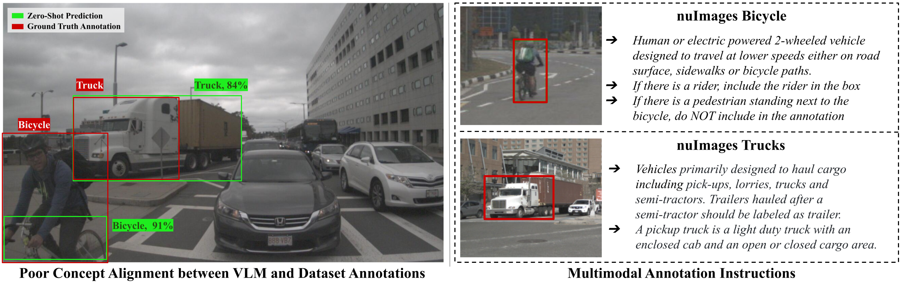

# Foundational FSOD with RoboFlow-20VL
[](https://arxiv.org/abs/2312.14494)
[](https://huggingface.co/anishmadan23/foundational_fsod/tree/main)
[](https://eval.ai/web/challenges/challenge-page/2459/overview)

### This repository is adapted from the [Foundational FSOD paper's code](https://github.com/anishmadan23/foundational_fsod). It currently supports Detic Zero-Shot baseline for the [RF-20VL Challenge](https://eval.ai/web/challenges/challenge-page/2459/overview). 

#### Support for other Detic baseline variants exist in this repo and should be straightforward to extend.
<!-- ## SWITCH TO MQDET BRANCH FOR RUNNING MQDET EXPTS
## IMP NOTE: Use [the test_set.json](https://huggingface.co/anishmadan23/foundational_fsod/blob/main/nuimages_coco_fmt/annotations/test_set.json) file for evaluating performance. -->

<!-- #### [Anish Madan](https://anishmadan23.github.io/), [Neehar Peri](https://www.neeharperi.com/), [Shu Kong](https://aimerykong.github.io/), [Deva Ramanan](https://www.cs.cmu.edu/~deva/) -->



## :star: [Foundational FSOD Challenge](https://eval.ai/web/challenges/challenge-page/2270/overview)
We are releasing a [Foundational FSOD challenge](https://eval.ai/web/challenges/challenge-page/2270/overview) as part of the [Workshop on Visual Perception and Learning in an Open World](https://vplow.github.io/vplow_4th.html) at CVPR 2024. We are accepting submissions till 7th June 2024! 

## Installation
See [installation instructions](docs/INSTALL.md).

## Models
Create `models/` in the root directory and download pre-trained model [here](https://huggingface.co/anishmadan23/foundational_fsod/tree/main/pretrained_models/)

## Replicating Detic ZS baseline on all datasets in RF-20VL

1. All dataset links are in `datasets_links.csv` . To download and preprocess the data, run 
   
```bash
python scripts/preprocess_data.py
```

2. Generate training/evaluation configs to run baselines

```bash
python scripts/generate_expt_cfgs.py
```
3. Use the generated configs to create commands for running baseline expts.
```bash
python scripts/generate_zero_shot_eval_cmds.py
```

4. Run expts using shell script generated by the previous script.

```bash
sh scripts/zero_shot_expts.sh
```

5. After the expts finish, run the following command to combine individual predictions into a zip file, compatible with challenge submission guidelines.
   
```bash
python scripts/combine_preds.py
```  


## Acknowledgment
We thank the authors of the following repositories for their open-source implementations which were used in building the current codebase:
1. [Detic: Detecting Twenty-thousand Classes using Image-level Supervision](https://github.com/facebookresearch/Detic)
2. [Detectron2](https://github.com/facebookresearch/detectron2)

## Citation
If you find our paper and code repository useful, please cite us:
```bib
@article{madan2023revisiting,
  title={Revisiting Few-Shot Object Detection with Vision-Language Models},
  author={Madan, Anish and Peri, Neehar and Kong, Shu and Ramanan, Deva},
  journal={arXiv preprint arXiv:2312.14494},
  year={2023}
}
```
